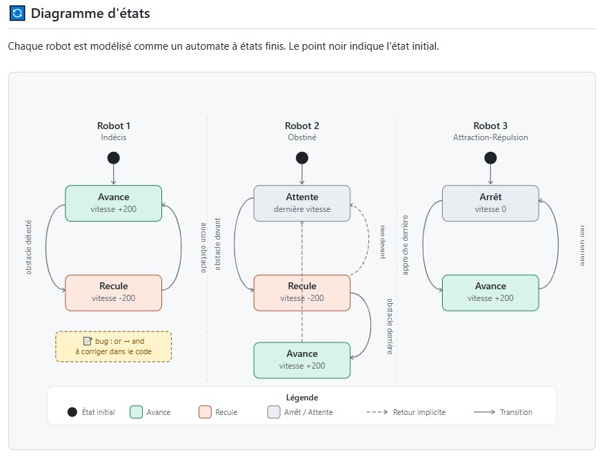

# Projet_Robotique
# Karl Hermes AVOCE
# V1- La "Chaîne de Sécurité"
 Combinaison : Paranoïaque B / Timide / Timide
 
# comportement Paranoiaque B 
Machine à état : 
 gauche = (vals[0] + vals[1]) / 2.0 
 centre = vals[2]
 droite = (vals[3] + vals[4]) / 2.0

gauche ->g 
droite ->d
centre ->c


# Timide : 

Machine à état :   


# 🤖 Convoi de Robots Thymio — Trois Personnalités : Indécis/Obstiné/Attracction-répulsion (Karl AVOCE & Ouafaa BAHADDOU)

Projet de robotique comportementale avec **3 robots Thymio** connectés simultanément via port série, chacun doté d'une personnalité distincte basée sur la lecture de ses capteurs de proximité.

---

## 📋 Description

Ce programme pilote trois robots Thymio en parallèle, chacun réagissant à son environnement de manière autonome selon une logique comportementale différente :

| Robot | Personnalité | Comportement résumé |
|-------|-------------|---------------------|
| Thymio 1 | **Indécis** | Avance si aucun obstacle n'est détecté, recule sinon |
| Thymio 2 | **Obstiné** | Recule si un obstacle est devant, avance si l'obstacle est derrière |
| Thymio 3 | **Attraction-Répulsion** | Avance quand on l'approche par derrière, s'arrête sinon |

---

## 🧠 Détail des Personnalités

### 1. Indécis (`Indecis`)

Le robot hésite face aux obstacles :

- Si **aucun obstacle** (gauche, centre et droite < 500) → il **avance** (vitesse 200)
- Sinon → il **recule** (vitesse -200)

> 📝 La condition dans le code utilise un `or` — il s'agit d'une erreur de frappe que j'ai découvert en écrivant le readme à corriger en `and` pour correspondre au comportement voulu.

---

### 2. Obstiné (`obstine`)

Le robot persiste dans sa direction malgré les obstacles :

- Si obstacle **devant** (gauche, centre ou droite > 500) → il **recule**
- Si obstacle **derrière** (capteurs arrière > 500) → il **avance**
- Sinon → il reste à la dernière vitesse (aucune commande moteur envoyée)

---

### 3. Attraction-Répulsion (`ar_rep`)

Comportement inspiré des forces d'attraction magnétique :

- Si obstacle **derrière** (capteurs arrière > 500) → il **avance** (attiré par ce qui est derrière lui)
- Sinon → il **s'arrête** complètement (vitesse 0)

---
### 3. Diagramme d'etats



## ⚙️ Prérequis

- Python 3.x
- Bibliothèque [`thymiodirect`](https://pypi.org/project/thymiodirect/)
- 3 robots Thymio connectés en USB/série
- Ports série disponibles et détectés automatiquement

### Installation des dépendances

```bash
pip install thymiodirect
```

---

## 🔌 Connexion des robots

Les robots sont détectés automatiquement via `ThymioSerialPort.get_ports()` :

```
thymio_serial_ports[0]  →  Robot 1 (Indécis)
thymio_serial_ports[1]  →  Robot 2 (Obstiné)
thymio_serial_ports[2]  →  Robot 3 (Attraction-Répulsion)
```

> ⚠️ L'ordre de connexion USB peut varier selon les plateformes. Si les comportements semblent inversés, débrancher/rebrancher les robots dans le bon ordre.

---

## 🚀 Lancement

```bash
python Convoi.py
```

Le programme tourne en boucle jusqu'à ce que la variable `done` passe à `True` (à déclencher manuellement dans le code ou via un événement futur).

---

## 📡 Capteurs utilisés

Chaque robot lit le tableau `prox.horizontal` (7 valeurs) :

| Index | Capteur |
|-------|---------|
| 0, 1 | Proximité avant gauche |
| 2 | Proximité avant centre |
| 3, 4 | Proximité avant droite |
| 5, 6 | Proximité arrière |

**Seuil de détection utilisé : 500**

---

## 📁 Structure du code

```
Convoi.py
├── on_comm_error()     # Gestionnaire d'erreur de communication
├── Indecis()           # Comportement robot 1
├── obstine()           # Comportement robot 2
├── ar_rep()            # Comportement robot 3
└── main                # Connexion, assignation des observers, boucle principale
```

---

## 🔧 Pistes d'amélioration

- [ ] Ajouter une condition d'arrêt propre (bouton central, durée limitée...)
- [ ] Ajouter la gestion des LEDs pour visualiser l'état de chaque robot
- [ ] Implémenter une communication entre robots (convoi coordonné)
- [ ] Ajouter un comportement de suivi de ligne via `prox.ground.delta`

---

## 👥 Auteurs

Projet de robotique comportementale — Robots Thymio  : Ouafaa BAHADDOU & Karl AVOCE
Bibliothèque : `thymiodirect`
