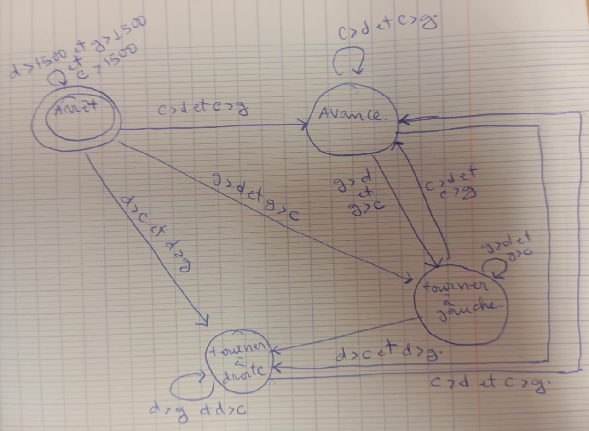
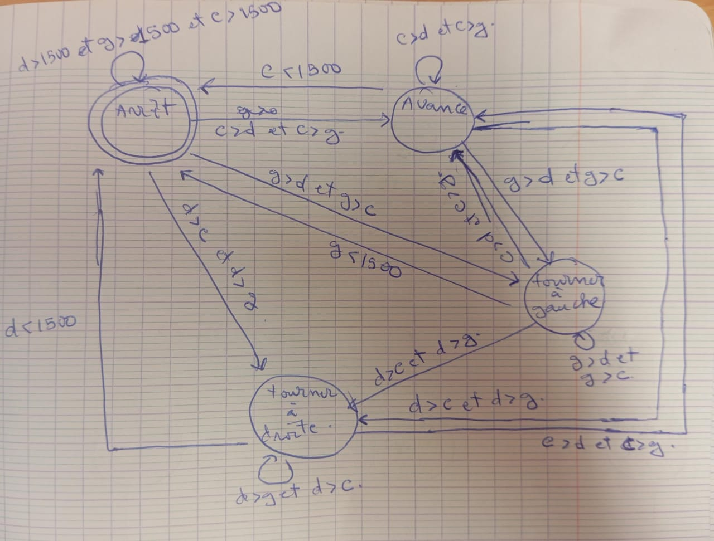

# Projet_Robotique
# Karl Hermes AVOCE
# V1- La "Chaîne de Sécurité"
 Combinaison : Paranoïaque B / Timide / Timide
 
# comportement Paranoiaque B 
Machine à état : 
 gauche = (vals[0] + vals[1]) / 2.0 
 centre = vals[2]
 droite = (vals[3] + vals[4]) / 2.0

gauche ->g 
droite ->d
centre ->c

# Timide : 

Machine à état :   

